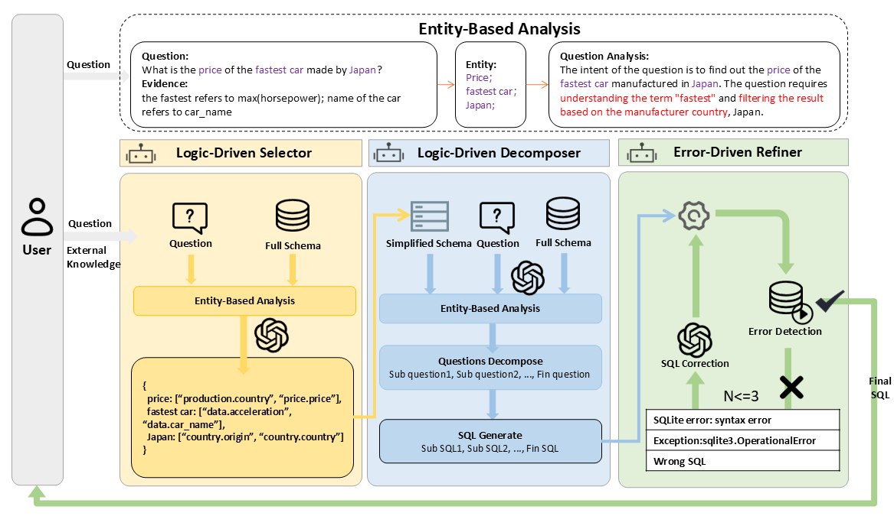

# EBA-SQL: A Multi-Agent Collaborative Framework with Entity-Based Analysis for Text-to-SQL 


## Introduction
In this paper, we propose **Entity-Based Analysis (EBA)**, a novel strategy to improve LLMs' question understanding and attention. Furthermore, we introduce EBA-SQL, a multi-agent collaboration framework based on this strategy, which comprises three agents: the **Logic-Driven Selector**, the **Logic-Driven Decomposer**, and the **Error-Driven Refiner**.

<p align="center">
  
</p>


## Full Intro.
Recently, LLMs' in-context learning methods have achieved significant success in text-to-SQL tasks. Most approaches typically adopt a straightforward and effective three-stage workflow: 1) schema linking. 2) SQL generation and 3) self-correction. However, processing subtasks solely through the single chain-of-thought prompt method limits the reasoning capabilities of LLMs. In this work, we propose Entity-Based Analysis (EBA), a novel strategy to improve LLMs' question understanding and attention. Furthermore, we introduce EBA-SQL, a multi-agent collaboration framework based on this strategy. At the core of our framework is the Logic-Driven Decomposer agent, which adheres to the Entity-Based Analysis and is responsible for question decomposition and SQL generation. Two auxiliary agents, the Logic-Driven Selector and the Error-Driven Refiner, are responsible for schema linking and self-correction, respectively. Experimental results demonstrate the effectiveness and efficiency of our framework. Specifically, experiments on the BIRD dataset show that our method achieves state-of-the-art (SOTA) performance with an execution accuracy of 63.50% on the test set in a series of open-source GPT-4 based text-to-SQL systems. Extensive analysis and ablation studies confirm that our framework achieves superior token and time efficiency, demonstrating strong potential for practical applications.


## ⚡Environment

Config your local environment.

```bash
conda create -n EBASQL python=3.9 -y
conda activate EBASQL
cd EBA-SQL
pip install -r requirements.txt
python -c "import nltk; nltk.download('punkt')"
```

Note: we use `openai==0.28.1`, which use `openai.ChatCompletion.create` to call api.


## 🔧 Data Preparation

In order to prepare the data more quickly, the `bird dev set related files` should be in `data/bird/dev/`,  the `spider set related files` should be in `data/spider/`.

For more details, please refer to `🌟 Project Structure`.


## 🚀 Run

We provide the run script.
You should open code comments for different usage.

- `run.sh` for Linux/Mac OS.
- `run.bat` for Windows OS.
- `run_spider.bat` for spider dataset.


## 📝Evaluation Dataset
We provide the script for Linux systems and Windows systems.

**run_evaluation.sh** and **run_evaluation.bat**.

## 🌟 Project Structure

```txt
├─data # store datasets and databases
|  ├─bird
|  |  ├─dev    # store bird dev set and dev databases
|  |  ├─test   # store bird test set and test databases
|  ├─spider    # store spider set
├─core
|  ├─agents.py       # define three agents class
|  ├─agents_difficult.py # define two difficult agents class
|  ├─api_config.py   # OpenAI API ENV config
|  ├─bridge_content_encoder.py
|  ├─chat_manager.py # manage the communication between agents
|  ├─const.py        # prompt templates and CONST values
|  ├─llm.py          # api call function and log print
|  ├─utils.py        # utils function
|  ├─utils_difficult.py        # difficult utils function
├─evaluation # evaluation scripts
|  ├─evaluation.py
|  ├─evaluation_spider.py
|  ├─evaluation_ves.py
|  ├─exec_eval.py
|  ├─parse.py
|  ├─process_sql.py
├─evaluation_bird_ex.sh # bird evaluation script in Linux
├─evaluation_bird_ex.bat # bird evaluation script in Windows
├─README.md
├─requirements.txt
├─run.bat # generation and evaluation script in Windows
├─run.py # main run script
├─run.sh # generation and evaluation script in Linux
├─run_spider.bat # run script for spider dataset
```

